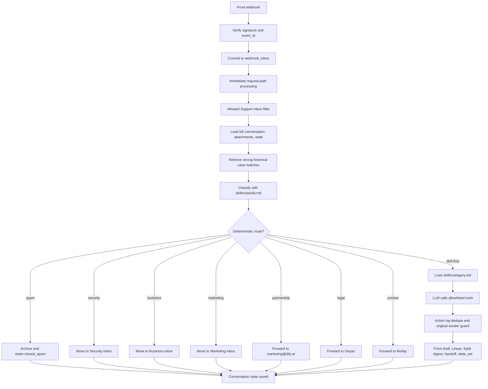
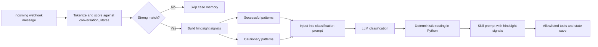

# Front-Agent

Front-Agent is the Dify support mailbox automation service. It receives Front webhooks, loads the full conversation and attachments, classifies the email with an OpenAI-compatible LLM, applies deterministic Python routing where possible, and otherwise runs a constrained skill flow that can create Front drafts, move inboxes, create Linear tickets, queue Sybil digests, and save state.

Current production screen runs this branch from release directories under `/tmp/front-agent-release-*`.

## Current Runtime

- Service entry: `main.py`
- Stack: FastAPI, Front webhook, OpenAI-compatible LLM, SQLite, SQLAlchemy async, APScheduler
- Local production port: `8080` in screen `front-agent-v2`
- Start command: `bash start.sh`
- Health check: `GET /health`
- Webhook trust: signed Front webhooks are required by default
- Webhook recovery: authenticated conversation events are committed to `webhook_inbox` before immediate processing
- Attachments: authenticated downloads are restricted to exact HTTPS hosts and hard limits
- Customer replies: draft-only by default; direct customer send tools are blocked
- Spam: deterministic route may archive only clear spam/ads
- Non-spam: keep conversations open for review
- Sybil handoffs: queued for the daily Feishu digest, not emailed directly to Sybil
- Ops dashboard: `GET /ops` prioritizes actionable conversations, webhook recovery health, the education account exception queue, draft adoption, and metadata coverage; authenticated operators can soft-dismiss pending Sybil records
- Case memory: similar historical conversations are distilled into hindsight signals with retrieval evidence; they do not change deterministic routes or replace docs/GitHub grounding

## Processing Flow





Two layers decide behavior:

- `agent/routing.py`: deterministic routing for spam, unclear, security, business, marketing, partnership, and legal.
- `skills/*.md` via `agent/orchestrator.py`: LLM skill flow for education, account, technical, billing, purchase, roadmap, data export, and investment.

Technical support is intentionally skill-flow based because requests vary widely. The skill requires docs/GitHub grounding when relevant, and still creates drafts by default.

## Case Memory

`services/case_memory.py` retrieves similar historical rows from `conversation_states` and formats them as `Historical case memory / hindsight signals` prompt context before classification and before category skill execution.

Safety constraints:

- Matching is conservative: classification context requires at least 3 effective token overlaps; known-category skill context requires at least 2.
- Category and previous outcome only affect ranking after the overlap threshold is met; they cannot create a match by themselves.
- Each prompt item includes `match=` retrieval evidence so the model can ignore weak or irrelevant memories.
- Matched cases are separated into `Successful patterns` and `Cautionary patterns` rather than copied as raw history.
- Generic terms such as `support`, `issue`, `question`, and `request` are ignored.
- Email addresses and phone numbers are redacted before entering the prompt.
- Case memory is reference-only. Deterministic routing, tool allowlists, draft-only policy, and skill safety rules still win.
- Case memory does not replace documentation matching. Technical/docs grounding still comes from skill instructions and tools such as `docs_search` and `github_search`.

## Deterministic Routes

| Classification | Route | Tool/action | State |
|---|---|---|---|
| `spam` / clear ads | `spam_auto_close` | archive conversation | `closed_spam` |
| `unclear` | `manual_review_bobby` | forward to `bobby@dify.ai` | `manual_review` |
| `security` | `security_move_inbox` | move to Front inbox `Security` | `moved_inbox` |
| `business` / enterprise / procurement | `business_move_inbox` | move to Front inbox `Business` | `moved_inbox` |
| `marketing` | `marketing_move_inbox` | move to Front inbox `Marketing` | `moved_inbox` |
| `partnership` / marketplace / community | `partnership_forwarded_keep_open` | forward to `marketing@dify.ai` | `forwarded_keep_open` |
| `legal` or `legal_threat` flag | `legal_forwarded_keep_open` | forward to `geyan@dify.ai` | `forwarded_keep_open` |
| everything else | `*_skill_flow` | load `skills/<category>.md` | skill decides |

`confidence` is observability only. It must not control routing with a numeric threshold.

## Tool Safety

LLM cannot call arbitrary APIs. It can only call schemas in `agent/tool_registry.py`.

Important constraints:

- LLM tool names and arguments are validated against the registered schema.
- Conversation IDs are rebound to the trusted webhook context before execution.
- Draft recipients are forced to the original sender immediately before the Front side effect.
- No generic `front_forward` tool is exposed.
- `front_close_conversation` is not exposed to the LLM; only deterministic spam can close.
- Deprecated direct reply tools are blocked.
- `front_create_draft` creates a Front draft only.
- Internal handoffs use dedicated `front_forward_to_*` tools.
- Internal recipients are restricted to `@dify.ai` where applicable.
- Handler exceptions notify Bobby through the deduplicated action log, explicitly reopen the original conversation, save `failed_needs_review`, do not mark the webhook event processed, and return HTTP 503 instead of a false success. The inbox row remains durable for internal retry.

## Idempotency and Original Sender Guard

There are two idempotency layers plus a durable recovery queue:

| Layer | Table | Key | Purpose |
|---|---|---|---|
| Recovery | `webhook_inbox` | Front `event_id` or deterministic body hash | persist authenticated conversation events before processing |
| Webhook | `webhook_events` | Front `event_id` | skip duplicate webhook deliveries |
| Tool side effects | `conversation_actions` | tool-specific scope + content hash | skip duplicate successful writes |

Normal handling still starts immediately in the HTTP request path. APScheduler
checks the durable inbox every minute because Front Rule Webhooks do not retry
failed deliveries. After the immediate attempt, failures wait 1, 5, 15, 60,
and 180 minutes. A failed attempt 6 becomes `dead_letter` and is logged for
manual review. Claims use a 15-minute lease so a process crash does not leave a
row permanently stuck in `processing`.

Successful processing clears the stored payload. Dead-letter rows retain their
payload and bounded diagnostic for manual recovery. `webhook_events` remains
the downstream idempotency ledger and records only successful or
deterministically ignored events, never retryable failures. Claims begin only
after the worker has the conversation lock and global execution capacity, so
queue wait time does not consume the lease.

Recovery provides at-least-once processing, not exactly-once external side
effects. If Front, Linear, or another provider accepts a write and the process
exits before the local `conversation_actions` or `webhook_events` commit, a
retry can repeat that write. Graceful scheduler shutdown waits up to 60
seconds for active jobs, reducing this window during planned deploys. Provider
idempotency or reconciliation is still needed for an exactly-once guarantee.

`conversation_actions` covers duplicate-prone writes:

| Tool | Action key |
|---|---|
| `front_create_draft` | normalized draft body hash |
| `front_add_comment` | normalized internal comment body hash |
| `linear_create_ticket` | trusted sender + original-message hash across conversations for 24 hours |
| `feishu_notify_sybil_group` / `front_forward_to_sybil` | handoff type + Linear URL, or message hash |
| `front_forward_to_bobby` / `front_forward_to_limin` / other internal forwards | summary/message hash |

Linear ticket deduplication is the exception to conversation-only scope: two
concurrent conversations from the same trusted sender with the same normalized
original message share an in-process lock and reuse the first successful ticket
for 24 hours. Model-supplied sender/message values cannot change this key. New
content, another sender, or the same issue after the window can create a ticket.
Other actions remain conversation-scoped, so new information can still produce
a materially different draft or handoff.

`conversation_states.sender_email` stores the original customer sender once known and is not overwritten by later internal forwards. `front_create_draft` receives this sender from Python so internal Bobby handoff messages cannot make drafts target `bobby@dify.ai`.

## Skills

Business rules live in `skills/`. Update a skill when changing classification examples, draft wording, or category policy. Update Python only for deterministic routes, new tools, or safety boundaries.

| Skill | Purpose |
|---|---|
| `classify.md` | classification JSON schema, examples, routing-oriented rules |
| `technical.md` | technical drafts, docs/GitHub grounding, paid/non-paid handling |
| `account.md` | login, deletion, transfer, email change, account anomaly, hacked account |
| `billing.md` | refund, duplicate charge, invoice, downgrade/cancel drafts; existing-invoice Credit Note confirmation |
| `education.md` | education review, Sybil digest handoff, proof requests |
| `purchase.md` | pricing, Enterprise contact guidance, reseller routing |
| `business.md` | documents deterministic Business inbox behavior |
| `partnership.md` | marketplace/community/plugin cooperation to marketing |
| `legal.md` | legal handoff to Geyan, no customer reply |
| `security.md` | security inbox behavior |

Reply-producing skills include a `Draft Quality Bar`: do not invent facts, do not mention internal tools or people, ask for missing facts, and avoid promises not proven by tool results or policy.

## State Model

SQLite models are in `models.py` and initialized by `database.py`.

| Table | Purpose |
|---|---|
| `conversation_states` | category, sub_type, step, waiting, payload, original sender |
| `conversation_actions` | tool-level action log and dedupe |
| `webhook_inbox` | durable authenticated webhook payloads, leases, retries, and dead letters |
| `webhook_events` | Front event idempotency |
| `sybil_notifications` | pending/sending/sent/dismissed Sybil digest queue; dismissed rows remain retained |

Important steps:

| Step | Meaning |
|---|---|
| `awaiting_*` | waiting for user information |
| `draft_created` | Front draft created for review |
| `forwarded_keep_open` | internal handoff sent, conversation remains open |
| `manual_review` | Bobby review required |
| `moved_inbox` | moved to another Front inbox |
| `failed_needs_review` | tool or handler did not safely complete |
| `closed_spam` | deterministic spam route archived |

Existing-invoice correction requests create a draft explaining that finalized
invoices cannot be changed, that updated billing details apply to future
invoices, and asking whether the customer wants a supplementary Credit Note.
Only an explicit second customer reply while in
`awaiting_credit_note_confirmation` adds a deduplicated internal Front comment
stating that the case should go to Elsie; it does not assign the conversation,
create a ticket, enter an Ops queue, or perform the Credit Note action.

## Code Map

```text
main.py                    FastAPI app, DB init, scheduler
config.py                  pydantic-settings config
database.py                SQLAlchemy async engine/session
models.py                  ORM models
start.sh                   local start script
railway.toml               optional Railway config
agent/orchestrator.py      main processing loop and skill execution
services/case_memory.py    conservative historical case-memory prompt context
services/ops_metadata.py   conservative Front metadata backfill for Ops rows
agent/classification.py    classification parsing/normalization
agent/routing.py           deterministic routes
agent/tool_registry.py     allowlisted tool schemas and dispatch
tools/front.py             Front API wrapper
tools/handoff.py           internal handoff helpers
tools/linear.py            Linear ticket creation
tools/state.py             state/action log helpers
tools/sybil_digest.py      Sybil digest queue and sender
webhooks/front_webhook.py  Front webhook boundary
routes/ops.py             Ops dashboard API and /ops page
routes/static/ops.html    Ops dashboard frontend
skills/                    business policy and draft instructions
tests/                     routing and skill safety tests
```

## Configuration

Use `.env.example` as the template. Do not commit real secrets.

```bash
FRONT_API_TOKEN=
FRONT_WEBHOOK_SECRET=
# Local development only. Keep false in production.
ALLOW_UNSIGNED_FRONT_WEBHOOKS=false
FRONT_APP_BASE_URL=https://app.frontapp.com/open
FRONT_ATTACHMENT_ALLOWED_HOSTS=api2.frontapp.com
MAX_ATTACHMENT_COUNT=5
MAX_ATTACHMENT_BYTES=10485760
MAX_ATTACHMENT_TEXT_CHARS=50000

OPENAI_API_KEY=
OPENAI_MODEL=gpt-5.5
MINIMAX_API_KEY=
MINIMAX_BASE_URL=https://api.minimax.chat/v1

LINEAR_API_KEY=
LINEAR_TEAM_ID=
LINEAR_CUS_PROJECT_ID=

INTERNAL_FORWARD_BOBBY_EMAIL=bobby@dify.ai
INTERNAL_FORWARD_LIMIN_EMAIL=bobby@dify.ai
INTERNAL_FORWARD_SYBIL_EMAIL=sybil@dify.ai
MARKETING_PARTNERSHIP_EMAIL=marketing@dify.ai
MARKETING_INBOX_NAME=
SECURITY_INBOX_NAME=Security
BUSINESS_INBOX_NAME=Business
GEYAN_EMAIL=geyan@dify.ai
CLAUDIA_EMAIL=

DATABASE_URL=sqlite+aiosqlite:///./email_automation.db
ENABLE_SCHEDULER=true
OPS_WRITE_SECRET=
PORT=8000
```

`FRONT_WEBHOOK_SECRET` is the API secret shown by Front's Webhooks app, not the
Front API token. It is required by default. For local webhook fixtures only,
set `ALLOW_UNSIGNED_FRONT_WEBHOOKS=true`; never enable it in production.
`FRONT_ATTACHMENT_ALLOWED_HOSTS` must contain only exact Front-managed HTTPS
hosts used by the deployment. Attachment count, byte, and text limits bound
memory use and model prompt growth.

`OPS_WRITE_SECRET` enables authenticated Ops mutations. The
`DELETE /ops/api/sybil/{id}` endpoint changes only a `pending` notification to
`dismissed`; it does not delete the database row, `sent` rows are immutable, and dismissed
rows remain visible for audit. The digest atomically claims pending rows as
`sending`, so an in-flight send cannot be reported as dismissed. The Ops page
keeps the entered secret only in page memory. Use HTTPS for remote access.

See [Runtime Security and Retry Boundaries](docs/runtime-boundaries.md) for
deployment checks, failure semantics, and the exact verification commands.

## Local Run

```bash
python3 -m venv .venv
source .venv/bin/activate
pip install -r requirements.txt
cp .env.example .env
bash start.sh
curl http://localhost:8000/health
```

Production-like local screen currently uses port `8080` and release directories under `/tmp/front-agent-release-*`.

## Optional Railway Deploy

`railway.toml` exists for Railway, but the active local deployment in this workspace is the `front-agent-v2` screen process. If using Railway, configure environment variables in Railway and point Front webhook to the Railway public URL.

## Change Checklist

Run before commit/deploy:

```bash
.venv/bin/python tests/test_webhook_recovery.py
.venv/bin/python tests/test_linear_ticket_deduplication.py
.venv/bin/python tests/test_runtime_boundaries.py
.venv/bin/python tests/test_ops_sybil_dismissal.py
.venv/bin/python tests/test_ops_data_quality.py
.venv/bin/python tests/test_routing.py
.venv/bin/python tests/test_skills.py
.venv/bin/python tests/test_draft_adoption.py
.venv/bin/python -m compileall -q agent services tasks tools webhooks routes tests config.py main.py models.py
.venv/bin/python -m pip check
git diff --check
```

The tests are offline. After deployment, send a signed Front webhook as a live
smoke test; the repository suite does not call Front or the configured LLM.

## Maintenance Notes

- Do not commit `.env`, SQLite DB files, screen logs, virtualenvs, or generated caches.
- `screenlog.*` is runtime log output, not source.
- Production state should use a persistent SQLite path or external DB.
- Ops dashboard is available at `/ops` and reads existing processing state. Its overview separates actionable failures and queues from historical data gaps, and reports 30-day sender/summary coverage instead of presenting missing values as live facts. Its only operator write is authenticated soft dismissal of pending Sybil queue records. It does not edit skills or send customer messages. Use ENABLE_SCHEDULER=false for local UI-only previews next to a running production instance.
- Every 15 minutes, at most 20 missing conversation rows are enriched from Front, with actionable rows first and a 60-second run limit. The job only fills blank original sender and subject-derived summary fields, preserves the business activity timestamp, and never overwrites existing values.
- Ops report snapshots are generated once when the scheduler starts, then every 3 hours. Each run stores both `daily` and `monthly` reports in `ops_reports`; the dashboard reads the latest snapshot for the selected period.
