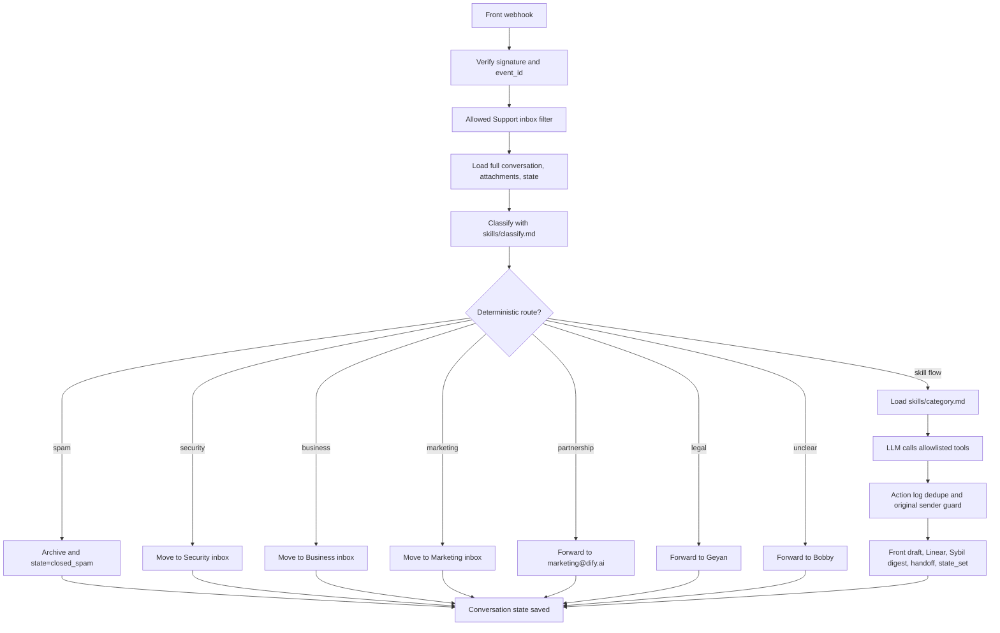

# Front-Agent

Front-Agent is the Dify support mailbox automation service. It receives Front webhooks, loads the full conversation and attachments, classifies the email with an OpenAI-compatible LLM, applies deterministic Python routing where possible, and otherwise runs a constrained skill flow that can create Front drafts, move inboxes, create Linear tickets, queue Sybil digests, and save state.

Current production screen runs this branch from release directories under `/tmp/front-agent-release-*`.

## Current Runtime

- Service entry: `main.py`
- Stack: FastAPI, Front webhook, OpenAI-compatible LLM, SQLite, SQLAlchemy async, APScheduler
- Local production port: `8080` in screen `front-agent-v2`
- Start command: `bash start.sh`
- Health check: `GET /health`
- Customer replies: draft-only by default; direct customer send tools are blocked
- Spam: deterministic route may archive only clear spam/ads
- Non-spam: keep conversations open for review
- Sybil handoffs: queued for the daily Feishu digest, not emailed directly to Sybil
- Feedback UI: code remains, runtime disabled by default with `ENABLE_FEEDBACK_SYSTEM=false`

## Processing Flow



Two layers decide behavior:

- `agent/routing.py`: deterministic routing for spam, unclear, security, business, marketing, partnership, and legal.
- `skills/*.md` via `agent/orchestrator.py`: LLM skill flow for education, account, technical, billing, purchase, roadmap, data export, and investment.

Technical support is intentionally skill-flow based because requests vary widely. The skill requires docs/GitHub grounding when relevant, and still creates drafts by default.

## Deterministic Routes

| Classification | Route | Tool/action | State |
|---|---|---|---|
| `spam` / clear ads | `spam_auto_close` | archive conversation | `closed_spam` |
| `unclear` | `manual_review_bobby` | forward to `bobby@dify.ai` | `manual_review` |
| `security` | `security_move_inbox` | move to Front inbox `Security` | `moved_inbox` |
| `business` / enterprise / procurement | `business_move_inbox` | move to Front inbox `Business` | `moved_inbox` |
| `marketing` | `marketing_move_inbox` | move to Front inbox `Marketing` | `moved_inbox` |
| `partnership` / marketplace / community | `partnership_forwarded_keep_open` | forward to `marketing@dify.ai` | `forwarded_keep_open` |
| `legal` or `legal_threat` flag | `legal_forwarded_keep_open` | forward to `geyan@dify.ai` | `forwarded_keep_open` |
| everything else | `*_skill_flow` | load `skills/<category>.md` | skill decides |

`confidence` is observability only. It must not control routing with a numeric threshold.

## Tool Safety

LLM cannot call arbitrary APIs. It can only call schemas in `agent/tool_registry.py`.

Important constraints:

- No generic `front_forward` tool is exposed.
- `front_close_conversation` is not exposed to the LLM; only deterministic spam can close.
- Deprecated direct reply tools are blocked.
- `front_create_draft` creates a Front draft only.
- Internal handoffs use dedicated `front_forward_to_*` tools.
- Internal recipients are restricted to `@dify.ai` where applicable.
- Handler exceptions notify Bobby, explicitly reopen the original conversation, save `failed_needs_review`, and do not mark the webhook event processed.

## Idempotency and Original Sender Guard

There are two idempotency layers:

| Layer | Table | Key | Purpose |
|---|---|---|---|
| Webhook | `webhook_events` | Front `event_id` | skip duplicate webhook deliveries |
| Tool side effects | `conversation_actions` | `conversation_id + action_type + action_key` | skip duplicate successful writes |

`conversation_actions` covers duplicate-prone writes:

| Tool | Action key |
|---|---|
| `front_create_draft` | normalized draft body hash |
| `linear_create_ticket` | normalized title hash |
| `feishu_notify_sybil_group` / `front_forward_to_sybil` | handoff type + Linear URL, or message hash |
| `front_forward_to_bobby` / `front_forward_to_limin` / other internal forwards | summary/message hash |

This is not conversation-level blocking. New user information can still produce a materially different draft, ticket, or handoff.

`conversation_states.sender_email` stores the original customer sender once known and is not overwritten by later internal forwards. `front_create_draft` receives this sender from Python so internal Bobby handoff messages cannot make drafts target `bobby@dify.ai`.

## Skills

Business rules live in `skills/`. Update a skill when changing classification examples, draft wording, or category policy. Update Python only for deterministic routes, new tools, or safety boundaries.

| Skill | Purpose |
|---|---|
| `classify.md` | classification JSON schema, examples, routing-oriented rules |
| `technical.md` | technical drafts, docs/GitHub grounding, paid/non-paid handling |
| `account.md` | login, deletion, transfer, email change, account anomaly, hacked account |
| `billing.md` | refund, duplicate charge, invoice, downgrade/cancel drafts |
| `education.md` | education review, Sybil digest handoff, proof requests |
| `purchase.md` | pricing, Enterprise contact guidance, reseller routing |
| `business.md` | documents deterministic Business inbox behavior |
| `partnership.md` | marketplace/community/plugin cooperation to marketing |
| `legal.md` | legal handoff to Geyan, no customer reply |
| `security.md` | security inbox behavior |

Reply-producing skills include a `Draft Quality Bar`: do not invent facts, do not mention internal tools or people, ask for missing facts, and avoid promises not proven by tool results or policy.

## State Model

SQLite models are in `models.py` and initialized by `database.py`.

| Table | Purpose |
|---|---|
| `conversation_states` | category, sub_type, step, waiting, payload, original sender |
| `conversation_actions` | tool-level action log and dedupe |
| `webhook_events` | Front event idempotency |
| `sybil_notifications` | pending/sent Sybil digest queue |
| `skill_feedback`, `skill_examples`, `skill_suggestions`, `skill_versions` | feedback learning tables; runtime UI disabled by default |

Important steps:

| Step | Meaning |
|---|---|
| `awaiting_*` | waiting for user information |
| `draft_created` | Front draft created for review |
| `forwarded_keep_open` | internal handoff sent, conversation remains open |
| `manual_review` | Bobby review required |
| `moved_inbox` | moved to another Front inbox |
| `failed_needs_review` | tool or handler did not safely complete |
| `closed_spam` | deterministic spam route archived |

## Code Map

```text
main.py                    FastAPI app, DB init, scheduler
config.py                  pydantic-settings config
database.py                SQLAlchemy async engine/session
models.py                  ORM models
start.sh                   local start script
railway.toml               optional Railway config
agent/orchestrator.py      main processing loop and skill execution
agent/classification.py    classification parsing/normalization
agent/routing.py           deterministic routes
agent/tool_registry.py     allowlisted tool schemas and dispatch
tools/front.py             Front API wrapper
tools/handoff.py           internal handoff helpers
tools/linear.py            Linear ticket creation
tools/state.py             state/action log helpers
tools/sybil_digest.py      Sybil digest queue and sender
webhooks/front_webhook.py  Front webhook boundary
skills/                    business policy and draft instructions
tests/                     routing and skill safety tests
```

## Configuration

Use `.env.example` as the template. Do not commit real secrets.

```bash
FRONT_API_TOKEN=
FRONT_WEBHOOK_SECRET=
FRONT_APP_BASE_URL=https://app.frontapp.com/open

OPENAI_API_KEY=
OPENAI_MODEL=gpt-5.5
MINIMAX_API_KEY=
MINIMAX_BASE_URL=https://api.minimax.chat/v1

LINEAR_API_KEY=
LINEAR_TEAM_ID=
LINEAR_CUS_PROJECT_ID=

INTERNAL_FORWARD_BOBBY_EMAIL=bobby@dify.ai
INTERNAL_FORWARD_LIMIN_EMAIL=bobby@dify.ai
INTERNAL_FORWARD_SYBIL_EMAIL=sybil@dify.ai
MARKETING_PARTNERSHIP_EMAIL=marketing@dify.ai
MARKETING_INBOX_NAME=
SECURITY_INBOX_NAME=Security
BUSINESS_INBOX_NAME=Business
GEYAN_EMAIL=geyan@dify.ai
CLAUDIA_EMAIL=

DATABASE_URL=sqlite+aiosqlite:///./email_automation.db
ENABLE_FEEDBACK_SYSTEM=false
PORT=8000
```

## Local Run

```bash
python3 -m venv .venv
source .venv/bin/activate
pip install -r requirements.txt
cp .env.example .env
bash start.sh
curl http://localhost:8000/health
```

Production-like local screen currently uses port `8080` and release directories under `/tmp/front-agent-release-*`.

## Optional Railway Deploy

`railway.toml` exists for Railway, but the active local deployment in this workspace is the `front-agent-v2` screen process. If using Railway, configure environment variables in Railway and point Front webhook to the Railway public URL.

## Change Checklist

Run before commit/deploy:

```bash
.venv/bin/python -m py_compile config.py agent/routing.py agent/tool_registry.py tests/test_routing.py tests/test_skills.py
.venv/bin/python tests/test_routing.py
.venv/bin/python tests/test_skills.py
git diff --check
```

## Maintenance Notes

- Do not commit `.env`, SQLite DB files, screen logs, virtualenvs, or generated caches.
- `screenlog.*` is runtime log output, not source.
- Production state should use a persistent SQLite path or external DB.
- Feedback/admin routes remain disabled unless `ENABLE_FEEDBACK_SYSTEM=true`.
