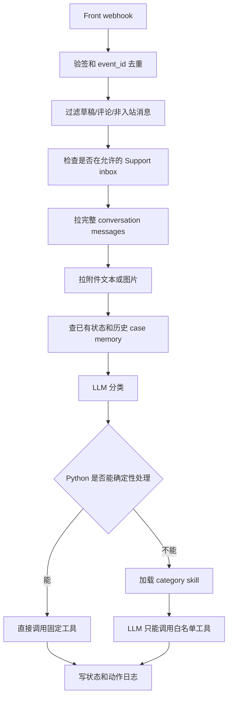

# Front-Agent 架构说明（脱敏工程版）

这份文档给团队看架构设计用，已经做了脱敏处理：不写真实客户、真实邮箱、真实人员、真实会话 ID、真实工单链接和生产密钥。

## 1. 这套系统到底在干什么

Front-Agent 不是一个“让 AI 自动回邮件”的系统。更准确地说，它是一个客服邮件处理流水线：

1. 从客服系统收到 webhook。
2. 拉完整会话和附件。
3. 让模型做分类和理解。
4. Python 决定哪些场景可以直接路由。
5. 复杂场景再让模型按 Skill 走流程。
6. 所有外部动作都通过白名单工具执行。
7. 每次处理都写状态和动作日志，方便去重和复盘。

设计上刻意没有把高风险动作直接交给模型。模型可以理解、总结、生成草稿、提出工具调用，但真正的副作用由代码控制。

## 2. 代码按职责拆开

现在代码基本是这个分层：

| 模块 | 负责什么 |
|---|---|
| `webhooks/front_webhook.py` | webhook 入口，验签、去重、过滤非客户消息、限制处理收件箱 |
| `agent/orchestrator.py` | 主编排，拉上下文、分类、加载 Skill、跑工具循环 |
| `agent/routing.py` | 确定性路由，哪些邮件不进自由 Agent 流 |
| `agent/classification.py` | 分类结果解析、归一化、兜底 |
| `agent/tool_registry.py` | 工具 schema 和工具执行入口 |
| `tools/*.py` | 具体外部系统调用，比如客服系统、工单、内部通知 |
| `skills/*.md` | 业务策略，告诉 Agent 每类邮件怎么处理 |
| `models.py` | 状态表、事件表、动作日志、通知队列 |
| `routes/ops.py` | 运营看板和报表 |

这里最重要的拆分是：**业务策略可以写在 Skill 里，但安全边界必须在 Python 里。**

Skill 写错了，最多影响模型选择；工具不暴露，模型就没法越权干活。

## 3. 一封邮件进来后的链路



这个链路有两个拦截点：

- webhook 层先拦掉不该处理的事件。
- routing 层再拦掉不该交给模型自由发挥的邮件。

## 4. 为什么要做确定性路由

不是所有问题都适合进 Agent loop。

这些场景现在用 Python 直接路由：

| 场景 | 当前处理 |
|---|---|
| 明显 spam | 自动归档 |
| 法务威胁 | 转内部法务角色，保持会话打开 |
| 安全报告 | 移到安全收件箱 |
| 企业采购/报价/合同 | 移到商务收件箱 |
| 市场活动/内容合作 | 移到市场收件箱 |
| marketplace/plugin/community 合作 | 转内部合作入口 |
| 无法判断 | 转人工复核 |

这么做的原因很简单：这些不是“回复质量”的问题，而是“归属和风险”的问题。  
让模型写得再好，也不该由它决定法务、商务、安全这类流转。

## 5. Skill 是策略，不是权限

`skills/*.md` 里写的是每个类别怎么处理，比如：

- 技术问题要先看文档或公开 issue。
- 账号问题要收集必要身份和部署信息。
- 账单问题默认创建草稿，不直接承诺退款。
- 教育申请要收学校、邮箱域名、证明材料。
- 招聘邮件走礼貌草稿。

Skill 的好处是改业务流程方便，不用每次都动主流程代码。

但 Skill 不是权限系统。真正的权限在 `agent/tool_registry.py`：

- 没暴露 direct reply 工具，所以模型不能直接发客户邮件。
- 没把 close conversation 暴露给模型，所以模型不能随便关会话。
- 没有通用 forward 工具，所以模型不能任意转发到陌生邮箱。
- 内部转交工具由 Python 固定目标或校验内部域。

这就是当前架构里最关键的安全线。

## 6. 工具调用怎么管

模型看到的是一组 function schema。它只能在这些 schema 里选工具。

工具执行时还会做几件事：

1. 自动补上下文，比如 draft 的收件人用原始客户邮箱，不信模型传入值。
2. 记录动作日志，避免重复草稿、重复工单、重复内部转发。
3. 拦截废弃或危险工具，比如 direct reply。
4. 工具失败时写失败状态，必要时转人工。
5. 某些动作后强制保持会话打开，比如创建工单或内部 handoff。

现在工具结果还是字符串，例如 `draft_created`、`forward_failed`。这够用，但不够强。后面最好改成结构化结果：

```json
{
  "ok": false,
  "code": "front_move_failed",
  "retryable": true,
  "message": "target inbox not found"
}
```

这样重试、报表和告警都会好做很多。

## 7. 状态和幂等

现在主要有四类表：

| 表 | 用途 |
|---|---|
| `webhook_events` | 按 event_id 防 webhook 重复 |
| `conversation_states` | 记录每个 conversation 当前状态 |
| `conversation_actions` | 按动作内容去重 |
| `sybil_notifications` | 内部通知队列 |

状态里常见 step：

- `draft_created`
- `awaiting_*`
- `forwarded_keep_open`
- `manual_review`
- `moved_inbox`
- `failed_needs_review`
- `closed_spam`

动作去重不是“一个会话只处理一次”，而是按动作内容去重。比如：

- 草稿按正文 hash 去重。
- 工单按标题 hash 去重。
- 内部转发按摘要 hash 去重。

这样客户后续补充新信息时，还可以产生新的有效动作。

当前不足也很明确：现在是先检查、再执行、再记录。单实例还行，多实例会有重复副作用风险。更稳的做法是 outbox/reservation：

1. 先在 DB 里抢占 action key。
2. 抢占成功才调用外部 API。
3. API 返回后更新结果。
4. 失败保留 retry 状态。

## 8. Case memory 怎么用

Case memory 不是让系统“自我进化”，也不会自动改规则。

它做的事比较克制：

- 从历史状态里找相似案例。
- 只取摘要、结果、失败信号。
- 邮箱和电话脱敏。
- 作为 prompt context 注入。
- 不覆盖 Python 路由。
- 不替代官方文档或工具结果。

这个设计的价值是让模型少踩重复坑，比如知道某类账号问题通常缺少哪些信息，某类技术问题之前需要先问部署方式。

## 9. 失败怎么兜底

现在失败路径大致是这样：

| 失败点 | 兜底 |
|---|---|
| 分类 JSON 解析失败 | 归一化为 unclear，走人工复核 |
| 确定性路由工具失败 | 写 `failed_needs_review`，必要时转人工 |
| Skill 跑完没写状态 | 写 `failed_needs_review` |
| 处理器异常 | 通知人工、尝试 reopen、写失败状态 |
| 内部通知队列失败 | 在原会话加内部备注，提醒人工处理 |

这块目前做得比较务实：失败不假装成功，尽量把会话保持打开，让人能接住。

## 10. 匿名案例

### 10.1 spam

客户说：

> 我们提供 SEO、外链和广告投放服务，想和贵司合作。

处理：

1. 分类为 spam。
2. Python 命中 spam 路由。
3. 调用关闭/归档工具。
4. 状态写 `closed_spam`。

这里不进 Skill，因为不需要模型生成任何回复。

### 10.2 技术问题

客户说：

> 工作流里某个节点读不到上一步输出，截图里有报错。

处理：

1. 分类为 technical。
2. 进入 technical Skill。
3. Agent 用 docs/github 搜索找依据。
4. 创建客服草稿，不直接发送。
5. 状态写 `draft_created`。

这里让模型干的是理解问题和组织草稿，不让它直接发邮件。

### 10.3 企业采购

客户说：

> 我们是某企业采购团队，想了解企业版报价、合同流程和安全材料。

处理：

1. 分类为 business。
2. Python 直接移动到 Business inbox。
3. 添加内部摘要。
4. 状态写 `moved_inbox`。

这里不需要 Agent 写回复，因为报价、合同、安全材料都应该由对应团队处理。

### 10.4 账号登录

客户说：

> 一直收不到验证码，之前也联系过支持，现在还不能登录。

处理：

1. 分类为 account。
2. 进入 account Skill。
3. 如缺少部署方式、账号类型、邮箱等信息，先创建补充信息草稿。
4. 如果看起来是付费账号或平台问题，创建工单并转人工。
5. 状态写 `awaiting_*`、`draft_created` 或 `forwarded_keep_open`。

这里多轮状态很重要，因为账号问题经常需要客户补充信息。

### 10.5 法务风险

客户说：

> 如果今天不能解决，我们会联系律师并采取进一步行动。

处理：

1. 分类结果带 `legal_threat`。
2. Python 路由覆盖原本类别。
3. 转内部法务角色。
4. 不创建客户草稿。
5. 状态写 `forwarded_keep_open`。

这里的重点是风险优先级。就算原始问题是账单或账号，只要出现法律威胁，就不能让普通 Skill 继续处理。

## 11. 当前架构的优点

比较扎实的地方：

- 入口、编排、路由、工具、状态分得比较清楚。
- 不是纯 prompt 驱动，关键动作在 Python。
- 直接回复和关闭会话都有硬限制。
- 确定性场景没有交给模型自由判断。
- 有动作去重和原始发件人保护。
- 有失败状态，不会静默吞掉问题。
- 有 Skill 测试，能防止策略文件引用危险工具。

## 12. 当前欠账

需要继续补的地方：

1. 状态机还不够硬。现在部分 step 还是靠 Skill 指导模型写，应该加 Python 校验。
2. 幂等还不是 outbox。多实例或外部 API 超时时，仍可能重复副作用。
3. Webhook 同步跑完整 Agent，链路偏重，容易被 LLM 或外部 API 拖慢。
4. 进程内 conversation lock 只能保护单实例。
5. SQLite 和应用内 scheduler 不适合横向扩展。
6. 工具结果用字符串，后续做重试和指标会不舒服。
7. 端到端测试还需要覆盖并发、重试、工具失败、客户补充信息。

## 13. 下一步怎么演进

建议按这个顺序来：

1. 先做强状态机：category、step、工具结果之间加合法转移校验。
2. 工具结果结构化：统一 `ok/code/retryable/message/payload`。
3. webhook 改 claim 模型：事件先落库为 processing，再异步处理。
4. 副作用改 outbox/reservation：先占坑，再调用外部 API。
5. scheduler 拆出去，或者加分布式锁。
6. 数据库从 SQLite 升到服务型数据库。
7. 补端到端测试和质量指标。

## 14. 对外怎么讲

可以这么说：

> 我们没有让模型直接接管客服邮件，而是把它放进一条受控流水线。模型负责理解、分类、总结和生成草稿；路由、权限、副作用、状态、去重和失败兜底都由代码控制。这样能让 Agent 真正干活，同时把风险关在工程边界里。

