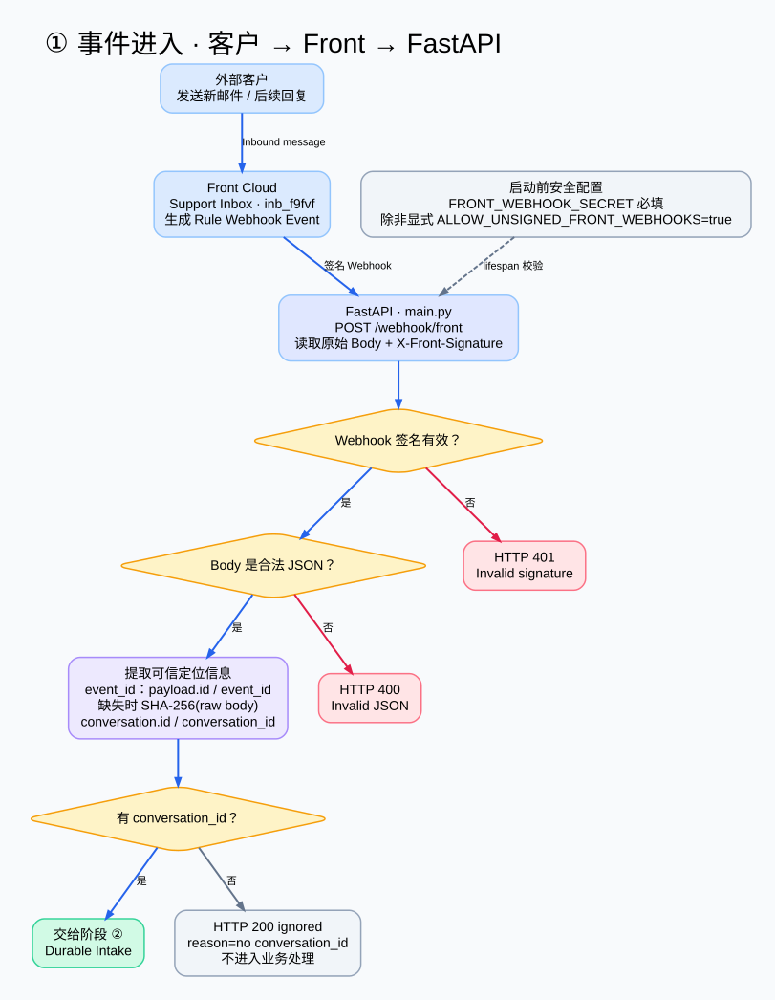
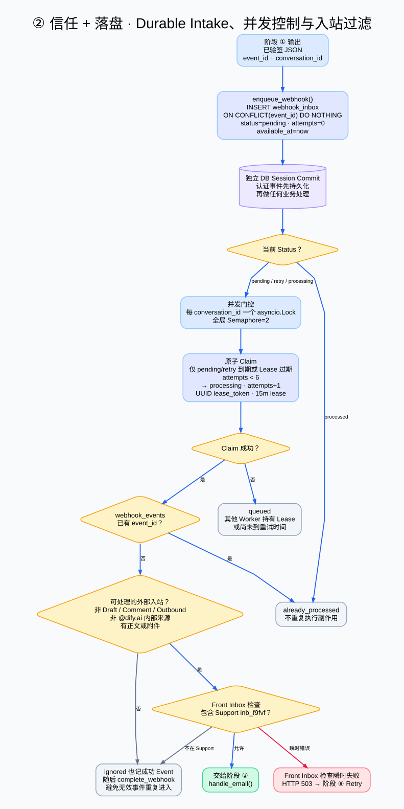
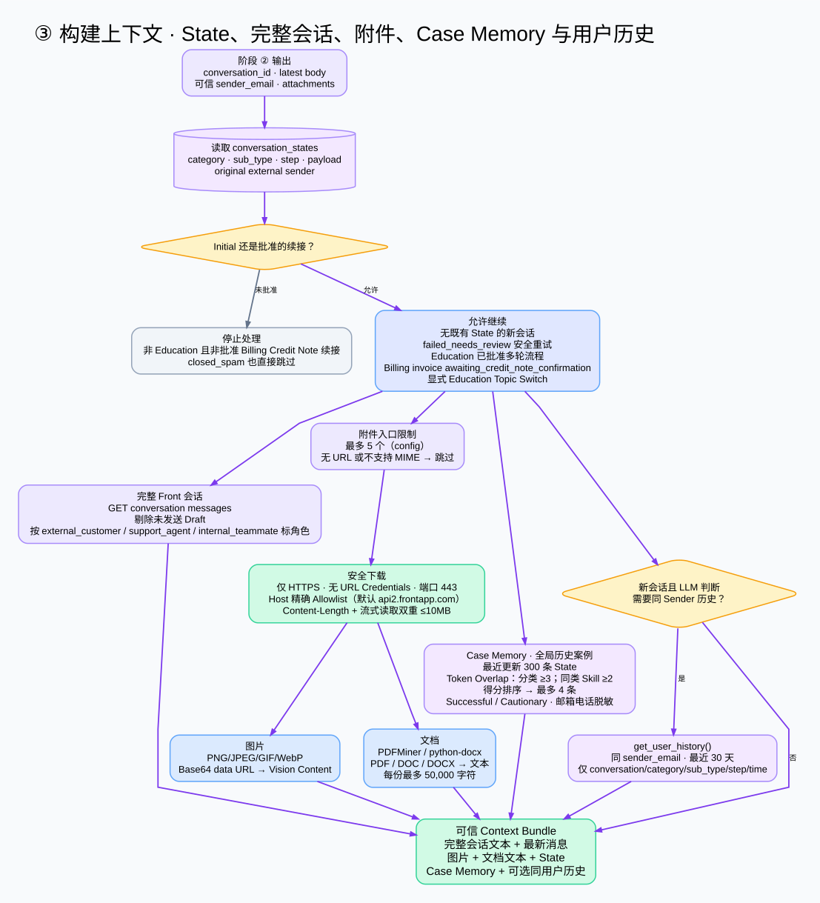
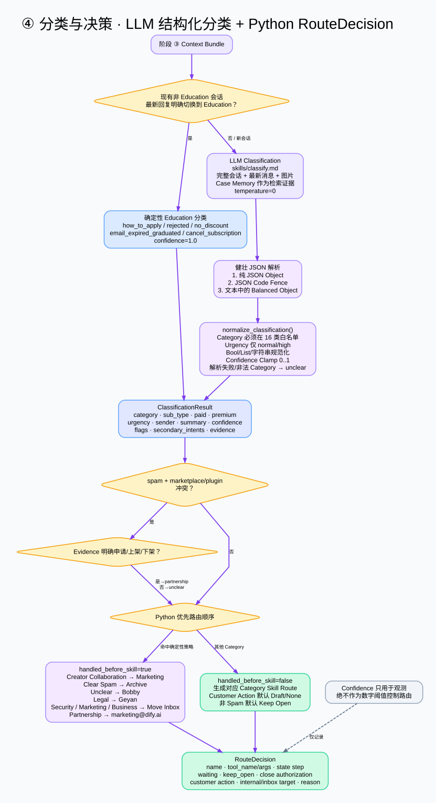
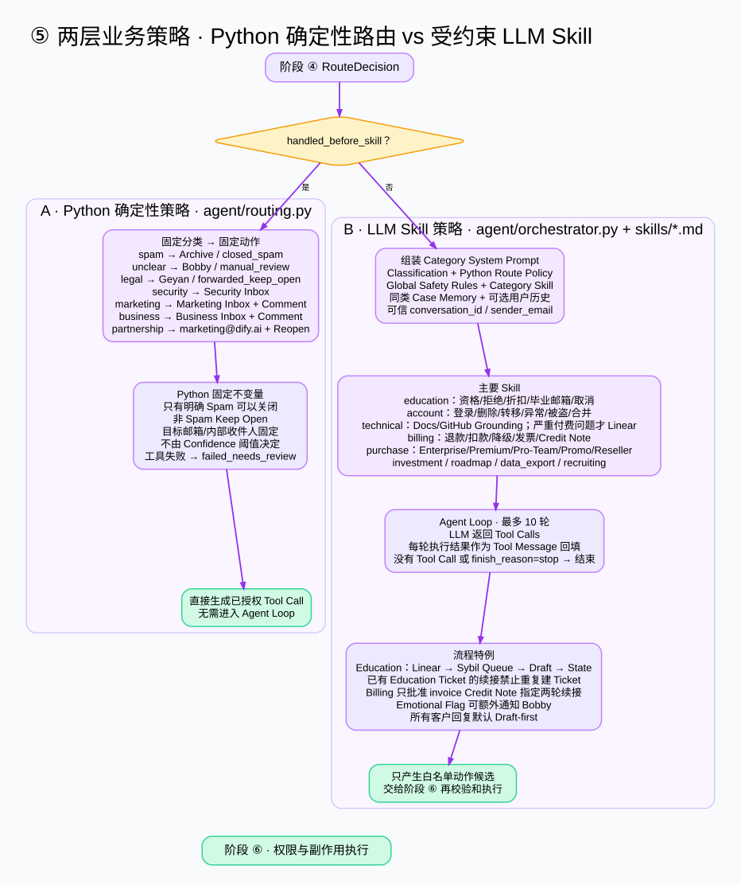
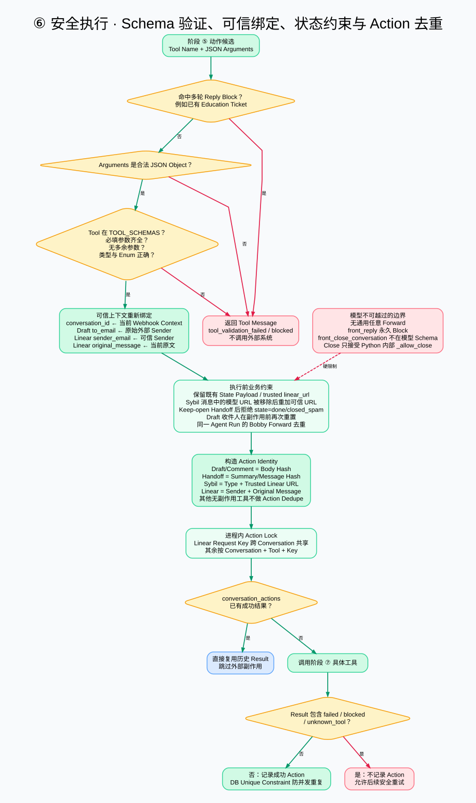
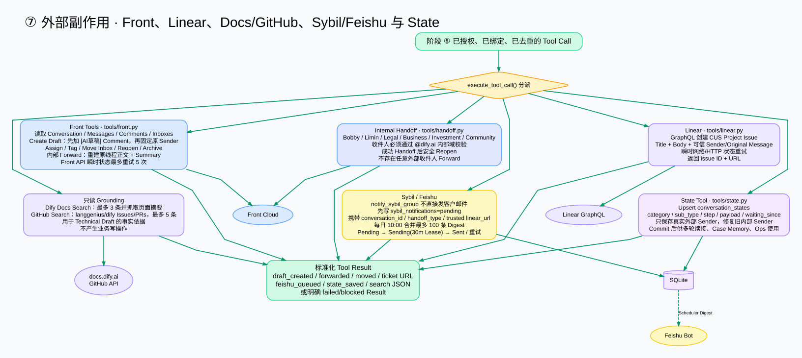
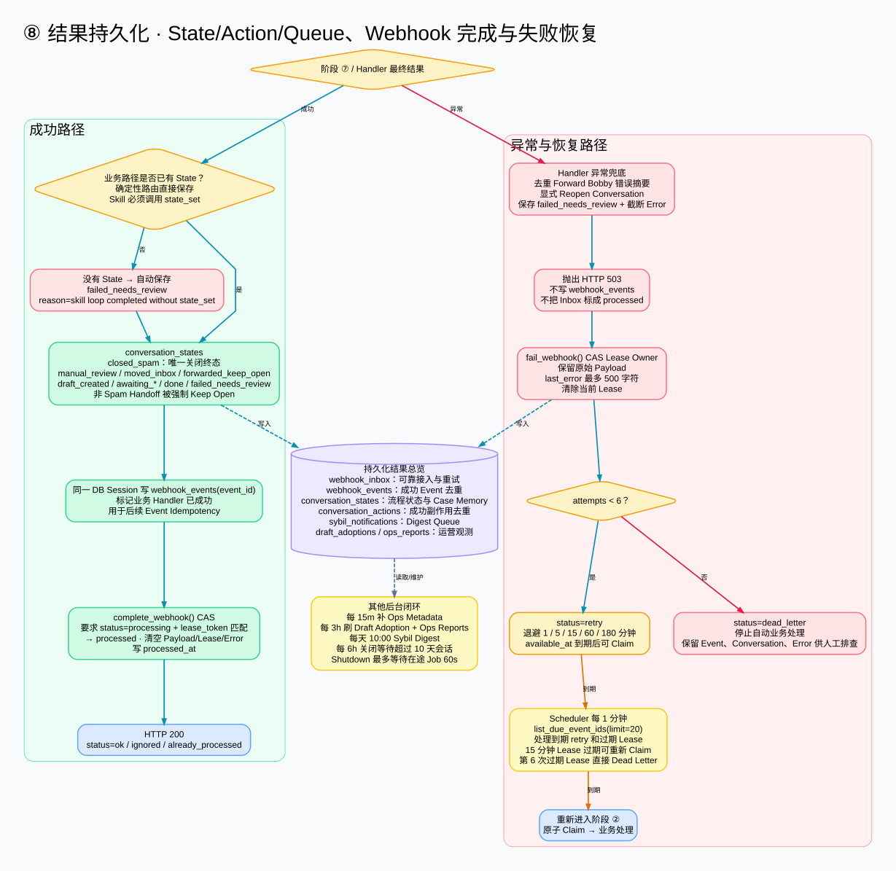

# Front-Agent 当前系统架构：①–⑧ 阶段拆解

> 本文是[单图泳道总览](current-system-architecture.md)的细节配套。原总览 SVG 保持不变；下面 8 张图分别展开总览 A 泳道中的 ①–⑧，每张图只处理一个阶段。

## 阅读约定

- 蓝色：可信输入、平台入口或正常结果。
- 紫色：上下文、LLM、业务策略或本地状态。
- 绿色：通过安全校验的执行路径。
- 黄色菱形：判断与分支。
- 红色：拒绝、失败、人工复核或重试。
- 虚线：约束、后台维护或非主链关系。

| 阶段 | 核心问题 | 输入 | 输出 |
|---|---|---|---|
| ① 事件进入 | 请求是否来自可信 Front Webhook？ | Front Rule Event | 已验签 JSON、Event ID、Conversation ID |
| ② 信任 + 落盘 | 如何先持久化、再并发安全地处理？ | 已验签 Event | 被 Claim 的外部 Support 入站消息 |
| ③ 构建上下文 | 模型真正能看到哪些可信信息？ | 会话、State、附件 | Context Bundle |
| ④ 分类与决策 | 如何从模型分类变成 Python RouteDecision？ | Context Bundle | 确定性路由或 Skill Route |
| ⑤ 两层业务策略 | 哪些由 Python 决定，哪些交给 Skill？ | RouteDecision | 已授权动作或白名单动作候选 |
| ⑥ 安全执行 | 模型动作如何被验证、重绑和去重？ | Tool Call Candidate | 可安全执行的 Tool Call |
| ⑦ 外部副作用 | 具体写入哪些外部系统？ | 已校验 Tool Call | Tool Result、State、Action、Queue |
| ⑧ 结果与恢复 | 如何提交成功、处理失败并自动重试？ | Handler / Tool Outcome | Processed、Retry 或 Dead Letter |

## ① 事件进入

这一阶段只建立 HTTP 信任边界，不做邮件分类或业务副作用。

- FastAPI 启动时要求配置 `FRONT_WEBHOOK_SECRET`；只有显式启用 `ALLOW_UNSIGNED_FRONT_WEBHOOKS=true` 才允许无签名模式。
- `POST /webhook/front` 读取原始 Body，用 HMAC-SHA1 + Base64 和 `X-Front-Signature` 做常量时间比较。
- 签名错误返回 401；JSON 错误返回 400；缺少 `conversation_id` 返回 ignored。
- Event ID 优先使用 Front 的 `id/event_id`，缺失时使用原始 Body 的 SHA-256，保证相同请求可以稳定去重。

主要源码：`main.py`、`webhooks/front_webhook.py`、`services/webhook_inbox.py`。

[打开 ① 高清 SVG](assets/architecture-details/01-event-ingress.svg) · [GraphViz 源图](architecture-details/01-event-ingress.dot)

## ② 信任 + 落盘

这一阶段负责 Durable Intake、并发控制、消息身份检查和 Support Inbox 边界。

- 认证 Event 先写入 `webhook_inbox` 并 Commit；数据库落盘失败直接返回 503，不会假装接收成功。
- Event ID 冲突使用 `ON CONFLICT DO NOTHING`，之后读取已有行，因此重复 Webhook 不会创建第二个 Inbox Record。
- 每个 Conversation 使用一个进程内 Lock；全局最多并发处理 2 个 Webhook。
- Claim 是原子更新：到期的 pending/retry 或 15 分钟 Lease 已过期的 processing 才能领取；领取时生成 UUID Lease Token，并增加 Attempts。
- 已成功的 `webhook_events`、非外部入站、内部邮件、Draft、Comment、Outbound 和非 Support Inbox Event 都会安全跳过。
- Front Inbox 查询的瞬时错误返回 503，交给阶段 ⑧ 的恢复机制。

主要源码：`webhooks/front_webhook.py`、`services/webhook_inbox.py`、`agent/message_identity.py`。

[打开 ② 高清 SVG](assets/architecture-details/02-trust-durable-intake.svg) · [GraphViz 源图](architecture-details/02-trust-durable-intake.dot)

## ③ 构建上下文

这一阶段把 Front、SQLite、附件和历史信号组装成模型可使用的受限上下文。

- State Gate 决定是新流程还是批准的续接：Education 可以续接；Billing 只允许 Invoice Credit Note 指定步骤；其他普通已处理会话默认忽略。
- 获取完整 Front 消息历史，但删除未发送 Draft，再将消息标记为外部客户、Support Agent 或内部同事。
- 附件最多 5 个；下载只允许 HTTPS、无 URL Credentials、443 端口和精确 Host Allowlist，并同时检查 Content-Length 与实际流式字节，默认上限 10MB。
- 图片转换为 Vision Base64；PDF/DOC/DOCX 提取文本，每份最多 50,000 字符。
- Case Memory 从最近更新的 300 条 State 中做 Token Overlap，分类阶段至少 3 个词、同 Category Skill 至少 2 个词，最多输出 4 条成功/警示信号。
- 新会话中，只有历史判断 LLM 返回 YES 时才读取同 Sender 最近 30 天的简化会话历史。

主要源码：`agent/orchestrator.py`、`tools/attachments.py`、`tools/front.py`、`services/case_memory.py`、`tools/state.py`。

[打开 ③ 高清 SVG](assets/architecture-details/03-context-building.svg) · [GraphViz 源图](architecture-details/03-context-building.dot)

## ④ 分类与决策

这一阶段将非确定性的邮件理解，转换成结构化、可验证的 Python RouteDecision。

- 分类器输出 16 个 Category 之一：technical、account、purchase、education、billing、partnership、marketing、security、spam、legal、roadmap、investment、business、data_export、recruiting、unclear。
- 输出还包含 Sub-type、Paid/Premium、Urgency、Summary、Confidence、Flags、Secondary Intents 和 Evidence。
- JSON 解析依次尝试纯 Object、Code Fence 和文本中的 Balanced Object；无法解析时安全降级为 unclear。
- Category 和 Urgency 均经过白名单规范化；Confidence 被限制在 0–1，但只用于观测，绝不作为路由阈值。
- Python 会修复 Spam 与 Marketplace/Plugin 的冲突，并按 Creator、Spam、Unclear、Legal、Security、Marketing、Business、Partnership 的优先顺序决定是否在 Skill 前处理。
- 最终输出包含 Tool、State Step、Keep-open、Close Authorization、内部目标和原因的 RouteDecision。

主要源码：`skills/classify.md`、`agent/classification.py`、`agent/routing.py`、`agent/orchestrator.py`。

[打开 ④ 高清 SVG](assets/architecture-details/04-classification-routing.svg) · [GraphViz 源图](architecture-details/04-classification-routing.dot)

## ⑤ 两层业务策略

这一阶段明确区分 Python 确定性策略和 LLM Skill 策略。

- Spam、Unclear、Legal、Security、Marketing、Business、Partnership 有固定目标、动作和 State，不需要进入 Agent Loop。
- 确定性策略掌握关闭权限；只有明确 Spam 可以 Archive，其他 Handoff 默认保持开放。
- Education、Account、Technical、Billing、Purchase、Investment、Roadmap、Data Export 和 Recruiting 等进入对应 `skills/*.md`。
- Skill Prompt 同时包含 Classification、Python Route Policy、Global Safety、Category Skill、Case Memory 和可选用户历史。
- Agent Loop 最多执行 10 轮；每次只能产生 Tool Schema 中的候选动作，Tool Result 会回填模型继续判断。
- Education 强制 Linear → Sybil Queue → Draft → State 的关键顺序，并阻止多轮回复重复创建 Ticket；Billing 只开放批准的 Credit Note 续接步骤。

主要源码：`agent/routing.py`、`agent/orchestrator.py`、`skills/*.md`。

[打开 ⑤ 高清 SVG](assets/architecture-details/05-policy-layers.svg) · [GraphViz 源图](architecture-details/05-policy-layers.dot)

## ⑥ 安全执行

这一阶段是模型与真实副作用之间的硬权限墙。

- Tool Name 必须出现在 `TOOL_SCHEMAS`；参数必须是 JSON Object，且满足必填字段、无额外字段、类型和 Enum 约束。
- `conversation_id` 永远从当前可信 Webhook Context 重绑；Draft Recipient 固定为原始外部 Sender；Linear 的 Sender 和 Original Message 也来自可信上下文。
- 已有 State Payload 与 Trusted Linear URL 会被保留；模型提供的 Sybil URL 会被移除后重新写入可信 URL。
- Keep-open Handoff 发生后，模型不能把 State 写成 `done` 或 `closed_spam`。
- 模型不可使用任意 Forward、Direct Reply 或 Close；Close 只接受 Python 内部授权。
- 有副作用的工具会生成 Action Identity，并通过进程内 Lock 与 `conversation_actions` 双重去重；只记录成功结果，失败结果保留重试能力。

主要源码：`agent/tool_registry.py`、`agent/orchestrator.py`、`tools/state.py`。

[打开 ⑥ 高清 SVG](assets/architecture-details/06-safe-execution.svg) · [GraphViz 源图](architecture-details/06-safe-execution.dot)

## ⑦ 外部副作用

这一阶段将已经授权的动作映射到具体 Provider。

- Front：读取会话、创建 Draft、添加 Comment、Assign、Tag、Move Inbox、Reopen、Archive 和内部 Forward；Draft 前添加 AI 分类说明，收件人固定为原客户。
- Internal Handoff：Bobby、Limin、Legal、Business、Investment、Community 等目标必须通过 `@dify.ai` 内部域校验。
- Linear：通过 GraphQL 在 CUS Project 创建 Issue，使用可信 Sender 与 Original Message，并返回 Issue ID/URL。
- Docs/GitHub：只读搜索，用于 Technical Grounding，不写入外部业务系统。
- Sybil/Feishu：实时请求只写入 Pending Queue，不直接向客户或 Sybil 发邮件；每天 10:00 合并成 Feishu Digest。
- State：Upsert Conversation State，保存 Category、Step、Payload、Waiting 和真实外部 Sender，为多轮流程、Case Memory 与 Ops 提供数据。

主要源码：`tools/front.py`、`tools/handoff.py`、`tools/linear.py`、`tools/docs_search.py`、`tools/github.py`、`tools/sybil_digest.py`、`tools/state.py`。

[打开 ⑦ 高清 SVG](assets/architecture-details/07-external-side-effects.svg) · [GraphViz 源图](architecture-details/07-external-side-effects.dot)

## ⑧ 结果持久化与恢复

这一阶段决定 Webhook 能否被正式确认，以及失败后如何恢复。

- Skill 如果执行结束却没有写 State，会自动生成 `failed_needs_review`，避免无状态地假装完成。
- 成功时先写 `webhook_events`，再用 Lease Token 做 CAS 完成 `webhook_inbox`；成功后清空原始 Payload、Lease 和 Error。
- Handler 异常会去重通知 Bobby、重新打开 Front Conversation，并保存截断后的 `failed_needs_review`。
- 失败不会写 `webhook_events`，也不会把 Inbox 标记为 Processed；原始 Payload 保留用于重放。
- 重试间隔依次为 1、5、15、60、180 分钟；最多 6 次，之后进入 Dead Letter。
- Scheduler 每分钟领取最多 20 个到期 Event；15 分钟 Lease 过期的任务可以重新 Claim。
- 同一数据层还支撑 Action Dedupe、Sybil Queue、Draft Adoption、Ops Report、Metadata 回填和 10 天等待会话清理。

主要源码：`webhooks/front_webhook.py`、`services/webhook_inbox.py`、`agent/orchestrator.py`、`tasks/scheduler.py`、`models.py`。

[打开 ⑧ 高清 SVG](assets/architecture-details/08-result-persistence-recovery.svg) · [GraphViz 源图](architecture-details/08-result-persistence-recovery.dot)

