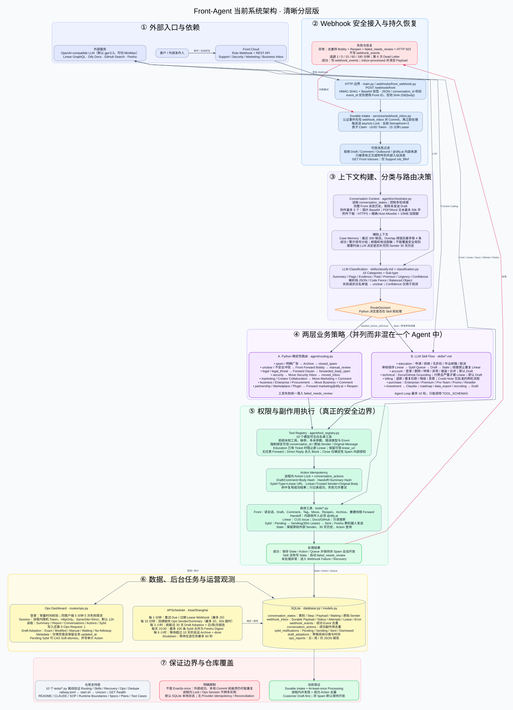

# Front-Agent 当前详细架构图

> 代码基线：`refactor/stable-agent-v2`，提交 `673049c`，梳理日期 `2026-08-05`。本图以当前代码为准；实线表示主要调用/数据流，虚线表示读取、观测、约束或失败回路。

[直接打开可无限缩放的 SVG 架构图](assets/front-agent-current-architecture.svg)



下面保留同一系统的 Mermaid 源图，便于在代码审查中搜索节点和继续维护。

```mermaid
%%{init: {"theme":"base","flowchart":{"htmlLabels":true,"curve":"basis","nodeSpacing":22,"rankSpacing":34},"themeVariables":{"fontFamily":"Inter, PingFang SC, Microsoft YaHei, sans-serif","fontSize":"13px"}}}%%
flowchart TB

  %% ─────────────────────── External actors and providers ───────────────────────
  subgraph EXT["外部参与者与平台"]
    direction LR
    Customer["客户 / 外部发件人"]
    Operator["运营人员 / Bobby<br/>浏览器访问 Ops"]
    FrontCloud["Front Cloud<br/>Rule Webhook + REST API<br/>Support / Security / Marketing / Business inbox"]
    LLMCloud["OpenAI-compatible LLM · agent/llm_client.py<br/>默认 OpenAI gpt-5.5<br/>非 OpenAI 模型可切 MiniMax base URL<br/>GPT-5 自动适配 temperature / token 参数"]
    LinearCloud["Linear GraphQL API<br/>CUS project"]
    DocsCloud["Dify Docs<br/>docs.dify.ai"]
    GitHubCloud["GitHub Search API<br/>langgenius/dify issues / PRs"]
    FeishuCloud["Feishu<br/>App Bot 群聊优先<br/>Bobby webhook 兜底"]
  end

  Customer -->|"发送邮件 / 后续回复"| FrontCloud
  Operator -->|"HTTPS /ops"| HTTP

  %% ─────────────────────────── Process bootstrap ───────────────────────────────
  subgraph BOOT["进程、配置与启动边界"]
    direction LR
    Start["start.sh<br/>加载 .env → 清理旧 uvicorn → 启动 :PORT<br/>RELOAD 仅本地可选"]
    Config["config.py / Settings<br/>Front、LLM、Linear、Feishu、Inbox、Ops、DB<br/>默认 SQLite: /tmp/email_automation.db"]
    Main["main.py / FastAPI lifespan<br/>校验 webhook secret<br/>校验 Ops 凭据<br/>init_db → start_scheduler<br/>退出时最多等待后台任务 60s"]
    HTTP["FastAPI HTTP 层<br/>/health<br/>/webhook/front<br/>/ops + /ops/api/*"]
    Headers["Ops 安全响应头 middleware<br/>no-store / CSP / no-referrer<br/>nosniff / DENY"]
    Start --> Main --> HTTP
    Config -.->|"环境配置"| Main
    HTTP --> Headers
  end

  FrontCloud -->|"POST /webhook/front<br/>X-Front-Signature"| WH1

  %% ───────────────────────── Durable webhook intake ────────────────────────────
  subgraph INGEST["实时接入与持久恢复 · webhooks/front_webhook.py + services/webhook_inbox.py"]
    direction TB
    WH1["读取原始 body<br/>HMAC-SHA1 + Base64 验签<br/>无 secret 仅本地显式放行"]
    WH2{"JSON 合法且<br/>有 conversation_id?"}
    WH3["derive_event_id<br/>payload.id / event_id<br/>否则 SHA-256(body)"]
    WH4["enqueue_webhook<br/>INSERT ON CONFLICT DO NOTHING<br/>先提交认证事件，再处理"]
    WH5["按 conversation_id 的 asyncio.Lock<br/>同会话串行"]
    WH6["全局 Semaphore = 2<br/>限制并发 webhook"]
    WH7["claim_webhook 原子抢占<br/>status=processing / attempts+1<br/>UUID lease token / 15 分钟租约"]
    WH8["_process_front_webhook_event"]
    WH9{"webhook_events<br/>已有 event_id?"}
    WH10["message_identity 入口过滤<br/>拒绝 draft / comment / outbound<br/>拒绝 @dify.ai author/from<br/>必须有正文或附件"]
    WH11["GET conversation inboxes<br/>仅允许 Support inb_f9fvf<br/>非目标 inbox 确定性忽略"]
    WH12["提取 latest body / 外部 sender / attachments"]
    WHOK["成功或确定性忽略<br/>写 webhook_events<br/>complete_webhook:<br/>status=processed + 清空 payload"]
    WHERR["异常兜底<br/>去重转发 Bobby + reopen Front<br/>state=failed_needs_review<br/>不写 webhook_events / 返回 503"]
    WHFAIL["fail_webhook<br/>retry: 1, 5, 15, 60, 180 分钟<br/>第 6 次 → dead_letter<br/>保留 payload + 截断错误"]

    WH1 --> WH2
    WH2 -->|"否"| IgnoreNoConv["200 ignored: no conversation_id"]
    WH2 -->|"是"| WH3 --> WH4 --> WH5 --> WH6 --> WH7 --> WH8 --> WH9
    WH9 -->|"是"| WHOK
    WH9 -->|"否"| WH10
    WH10 -->|"不可处理"| WHOK
    WH10 -->|"外部入站"| WH11
    WH11 -->|"不在 Support"| WHOK
    WH11 -->|"允许 / 非瞬态检查异常时谨慎继续"| WH12 --> ORCH0
    WH11 -->|"Front 瞬态失败"| WHERR
    ORCHEND --> WHOK
    ORCHERR --> WHERR --> WHFAIL
  end

  %% ───────────────────────── Context and orchestration ─────────────────────────
  subgraph ORCH["编排与上下文 · agent/orchestrator.py"]
    direction TB
    ORCH0["handle_email<br/>读取 conversation_states"]
    Gate{"是否允许继续处理?"}
    GateRules["新会话 / initial / done / failed_needs_review<br/>或明确 Education topic switch → 初始流<br/><br/>已有状态只继续：education 全流程<br/>或 billing/invoice 的<br/>awaiting_credit_note_confirmation<br/>其他回复直接跳过"]
    Context["拉取 Front 完整消息历史<br/>剔除未发送 draft<br/>message_identity 标注 User / Support"]
    Attach["附件管道 · tools/attachments.py<br/>最多 5 个；图片 → bounded base64<br/>PDF / Word → 提取文本并截至 50k 字符"]
    AttachGuard["下载安全 · tools/front.py<br/>仅 HTTPS + 精确 allowlist host<br/>禁凭据 / 非 443 端口<br/>Content-Length + 流式 10MB 双限额"]
    Memory["Case memory · services/case_memory.py<br/>最近最多 300 条 state 候选<br/>token overlap：分类≥3 / 同类 Skill≥2<br/>最多 4 条；成功/警示分组<br/>邮箱与电话脱敏；仅 prompt 参考"]
    HistoryAsk["初始流额外 LLM 判断<br/>是否需要 30 天同 sender 历史"]
    StateBranch{"初始分类<br/>还是获准的多轮续接?"}
    EduSwitch["确定性最新回复识别<br/>教育方案/折扣/认证主题<br/>可从非 education 状态切换"]
    ClassPrompt["skills/classify.md<br/>16 categories + sub_type<br/>summary / flags / evidence<br/>paid / premium / urgency / confidence"]
    ClassLLM["LLM 分类调用<br/>temperature 0<br/>支持图片内容"]
    Normalize["classification.py<br/>解析纯 JSON / code fence / 平衡对象<br/>白名单归一化；失败 → unclear<br/>confidence 仅观测，不作阈值"]
    Route["routing.py / decide_initial_route<br/>Python 生成 RouteDecision<br/>先处理 spam×partnership 冲突<br/>与 creator marketing 特例"]
    ORCHEND["编排成功返回"]
    ORCHERR["编排或工具异常"]

    ORCH0 --> Gate
    Gate -.-> GateRules
    Gate -->|"跳过既有非批准回复 / closed_spam"| ORCHEND
    Gate -->|"处理"| Context --> Attach
    Attach -.-> AttachGuard
    Context --> Memory
    Attach --> StateBranch
    Memory --> StateBranch
    ORCH0 -.-> EduSwitch --> StateBranch
    StateBranch -->|"初始流"| HistoryAsk --> ClassPrompt --> ClassLLM --> Normalize --> Route
    StateBranch -->|"education / Credit Note 续接"| SkillPrompt
    LLMCloud <-->|"Chat Completions"| HistoryAsk
    LLMCloud <-->|"Chat Completions"| ClassLLM
  end

  FrontCloud <-->|"会话、消息、附件"| Context
  FrontCloud --> AttachGuard
  CS -.->|"历史状态 / sender 历史"| ORCH0
  CS -.->|"相似案例"| Memory

  %% ─────────────────────── Classification and route policy ─────────────────────
  subgraph POLICY["路由与业务策略"]
    direction TB
    Det{"handled_before_skill?"}

    subgraph DETERMINISTIC["Python 确定性路由 · agent/routing.py"]
      direction LR
      RSpam["spam / 明确广告<br/>front_close_conversation<br/>仅内部 _allow_close=true<br/>→ closed_spam"]
      RUnclear["unclear / 冲突不安全<br/>Front forward → Bobby<br/>→ manual_review"]
      RLegal["legal 或 legal_threat<br/>Front forward 原线程 → Geyan<br/>→ forwarded_keep_open"]
      RSecurity["security<br/>move → Security inbox<br/>失败再通知 Bobby<br/>→ moved_inbox"]
      RMarketing["marketing 或 creator collaboration<br/>move → Marketing inbox + comment<br/>→ moved_inbox"]
      RBusiness["business / enterprise / procurement<br/>move → Business inbox + comment<br/>→ moved_inbox"]
      RPartner["partnership / marketplace / plugin<br/>Front forward 原线程 → marketing@dify.ai<br/>成功后 reopen<br/>→ forwarded_keep_open"]
      RFail["确定性工具失败<br/>→ failed_needs_review<br/>保存 route / result / fallback"]
    end

    subgraph SKILLS["LLM Skill 策略层 · skills/*.md"]
      direction LR
      SkillPrompt["加载 category Skill + 当前状态<br/>分类事实 + RouteDecision + memory<br/>全局安全规则 + 完整会话/附件"]
      SEdu["education<br/>how_to_apply / rejected / no_discount<br/>email_expired_graduated / cancel_subscription<br/>审核顺序：Linear → Sybil queue → draft → state<br/>续接禁止重复 Linear"]
      SAccount["account<br/>cant_login / delete / transfer / change_email<br/>anomaly / hacked / merge<br/>SaaS 可 Linear + Bobby/Sybil；默认 draft"]
      STech["technical<br/>workflow / bug / how_to / feasibility<br/>api / outage / privacy / self_hosted<br/>Docs/GitHub 找依据；付费且严重才 Linear；draft"]
      SBilling["billing<br/>refund / duplicate / downgrade / invoice / other<br/>已有发票：先 draft+等待确认<br/>二次明确确认仅加 Elsie comment + state"]
      SPurchase["purchase<br/>enterprise / premium / pro_team / promo / reseller<br/>通常 draft；reseller 转 marketing"]
      SOther["investment → Claudia+Bobby / keep open<br/>roadmap、data_export、recruiting → draft<br/>legal/business/marketing/security/partnership<br/>也有防御性 Skill 文件，但初始流通常已被 Python 截获"]
      SkillLLM["Agent loop ≤ 10 轮<br/>LLM 只能选择 TOOL_SCHEMAS<br/>无 tool_calls 或 stop → 结束"]

      SkillPrompt --> SEdu & SAccount & STech & SBilling & SPurchase & SOther
      SEdu & SAccount & STech & SBilling & SPurchase & SOther --> SkillLLM
    end

    Route --> Det
    Det -->|"是"| RSpam & RUnclear & RLegal & RSecurity & RMarketing & RBusiness & RPartner
    RSpam & RUnclear & RLegal & RSecurity & RMarketing & RBusiness & RPartner -->|"成功"| ORCHEND
    RSpam & RUnclear & RLegal & RSecurity & RMarketing & RBusiness & RPartner -->|"失败"| RFail --> ORCHEND
    Det -->|"否"| SkillPrompt
    LLMCloud <-->|"带 function calling 的 Chat Completions"| SkillLLM
  end

  %% ───────────────────────── Tool safety and dispatch ──────────────────────────
  subgraph TOOLING["权限与副作用边界 · agent/tool_registry.py"]
    direction TB
    Schemas["19 个模型可见白名单工具<br/>Front: draft / assign / comment / tag / 7 类 handoff/move<br/>Linear: create ticket<br/>Sybil: Feishu queue + compatibility alias<br/>State: state_set<br/>Read-only: docs_search / github_search"]
    Validate["prepare_llm_tool_call<br/>拒绝未知工具、缺参、多余参数<br/>校验 JSON 类型与 enum"]
    Trust["可信上下文重绑定<br/>conversation_id 永远来自当前 webhook<br/>draft.to_email = 原始外部 sender<br/>Linear sender + original_message 由 Python 注入"]
    RuntimeGuards["运行时流程护栏<br/>已有 education ticket → 阻止新 Linear<br/>保存 payload 时保留可信 linear_url<br/>Bobby 单轮去重<br/>Linear 或 Bobby/Limin/Sybil handoff 后强制 keep-open state<br/>deprecated direct reply 永久 blocked"]
    ActionId["action identity + WeakValue asyncio.Lock<br/>draft/comment: body hash<br/>handoff: summary/message hash<br/>Sybil: type + Linear URL 或 message hash<br/>Linear: trusted sender + original body hash"]
    Dedupe{"conversation_actions<br/>已有成功结果?"}
    Dispatch["_execute_tool_call_uncached<br/>仅这里调用具体 tools/*<br/>成功结果才记录 action；失败可重试"]
    MissingState["Skill 结束仍无 state<br/>→ failed_needs_review"]
    NoLLM["模型不可见的高风险路径<br/>无通用 arbitrary forward<br/>无 front_close schema<br/>front_reply / reply_with_template 即使被调也 blocked<br/>close 仅确定性 spam 传内部授权位"]

    SkillLLM --> Schemas --> Validate --> Trust --> RuntimeGuards --> ActionId --> Dedupe
    Dedupe -->|"命中"| ToolResult["复用已记录 result"]
    Dedupe -->|"未命中"| Dispatch --> ToolResult
    ToolResult -->|"作为 role=tool 回灌 LLM"| SkillLLM
    SkillLLM -->|"循环结束"| StateCheck{"存在 conversation state?"}
    StateCheck -->|"是"| ORCHEND
    StateCheck -->|"否"| MissingState --> ORCHEND
    NoLLM -.->|"硬边界"| Validate
  end

  %% ───────────────────────────── Concrete tools ────────────────────────────────
  subgraph TOOLS["具体工具实现 · tools/*.py"]
    direction LR
    FrontTool["tools/front.py<br/>5 次指数退避处理瞬态状态/网络错误<br/>读取 conversation/messages/comments/inboxes<br/>Markdown → allowlist HTML<br/>draft / assign / comment / tag / move / reopen / archive<br/>内部 forward 会重建原始线程正文"]
    HandoffTool["tools/handoff.py<br/>内部收件人必须以 @dify.ai 结尾<br/>Bobby / Limin compatibility → Front forward<br/>Sybil → 队列；失败在原会话加内部 comment"]
    LinearTool["tools/linear.py<br/>GraphQL mutation<br/>5 次指数退避<br/>CUS project / team"]
    SybilTool["tools/sybil_digest.py<br/>pending → sending(30m lease) → sent<br/>同 conversation 更新现有 pending<br/>发送失败恢复 pending<br/>dismissed 记录保留"]
    FeishuTool["tools/feishu.py<br/>群 chat_id App Bot 优先<br/>Bobby webhook 兜底<br/>@Sybil + type + Linear + Front link"]
    SearchTool["tools/docs_search.py<br/>搜索 Dify 文档并抓正文<br/><br/>tools/github.py<br/>搜索 langgenius/dify issues"]
    StateTool["tools/state.py<br/>get/set/clear state<br/>保留原始外部 sender<br/>30 天 user history<br/>action 查询与唯一约束冲突恢复"]
  end

  Dispatch --> FrontTool & HandoffTool & LinearTool & SybilTool & SearchTool & StateTool
  RSpam & RUnclear & RLegal & RSecurity & RMarketing & RBusiness & RPartner -.->|"Python 可信参数直接 execute_tool_call"| Dispatch
  HandoffTool --> FrontTool
  HandoffTool --> SybilTool --> FeishuTool
  FrontTool <-->|"REST API"| FrontCloud
  LinearTool <-->|"GraphQL"| LinearCloud
  SearchTool <-->|"HTTP"| DocsCloud
  SearchTool <-->|"HTTP"| GitHubCloud
  FeishuTool <-->|"Open API / webhook"| FeishuCloud

  %% ───────────────────────────── Persistence ───────────────────────────────────
  subgraph DATA["持久化 · database.py / models.py · SQLAlchemy async + aiosqlite"]
    direction LR
    DB[("SQLite DB<br/>create_all on startup")]
    CS["conversation_states<br/>PK conversation_id<br/>sender / category / sub_type / step<br/>JSON payload / waiting_since / timestamps"]
    WE["webhook_events<br/>PK event_id<br/>仅成功或确定性忽略"]
    WI["webhook_inbox<br/>PK event_id / conversation index<br/>payload / status / attempts / available_at<br/>lease / error / processed_at"]
    CA["conversation_actions<br/>UNIQUE conversation + type + key<br/>result / created_at<br/>Linear 另有跨会话 24h 查询"]
    SN["sybil_notifications<br/>conversation / message / cc / type / Linear URL<br/>pending / sending / sent / dismissed"]
    DA["draft_adoptions<br/>PK action_id → draft action<br/>hash / status / sent / checked / error"]
    OP["ops_reports<br/>daily / weekly / monthly<br/>window + generated_at + JSON payload"]
    DB --- CS & WE & WI & CA & SN & DA & OP
    CA -.->|"逻辑关联 action_id"| DA
    CS -.->|"conversation_id 逻辑关联"| CA
    CS -.->|"conversation_id 逻辑关联"| SN
  end

  WH4 --> WI
  WH7 <--> WI
  WHOK --> WE
  WHOK --> WI
  WHFAIL --> WI
  StateTool <--> CS
  Dedupe <--> CA
  SybilTool <--> SN

  %% ───────────────────────── Background scheduling ─────────────────────────────
  subgraph JOBS["后台任务 · tasks/scheduler.py / APScheduler · Asia/Shanghai"]
    direction LR
    JRetry["每 1 分钟<br/>最多取 20 个 due / 过期 lease webhook<br/>复用同会话锁 + Semaphore + claim 流程"]
    JMeta["每 15 分钟，首次延迟 5 秒<br/>最多 20 条缺 sender/summary state<br/>优先 attention；60 秒超时<br/>不改业务 updated_at"]
    JReport["每 3 小时，立即首跑<br/>串行 Ops maintenance lock<br/>先刷新近 30 天 draft adoption<br/>再生成 daily/weekly/monthly 报告"]
    JDigest["每天 10:00 中国时间<br/>最多 100 条 pending Sybil<br/>租约 claim 后合并为一条 Feishu digest"]
    JClose["每 6 小时<br/>waiting_since 超过 10 天且 step≠done<br/>Front archive + state step=done"]
    JDisabled["sync_missing_conversations<br/>代码保留但调度禁用<br/>系统只处理 webhook 触发邮件"]
    Grace["stop_scheduler<br/>pause → 等待在途任务最多 60 秒<br/>超时日志后 shutdown"]
  end

  Main --> JOBS
  JRetry -->|"list_due_event_ids"| WI
  JRetry --> WH5
  JMeta -->|"GET conversation metadata"| FrontCloud
  JMeta --> CS
  JReport --> Adoption
  JReport --> ReportBuild
  JDigest --> SybilTool
  JClose --> FrontTool
  JClose --> CS
  Grace -.->|"lifespan shutdown"| Main

  %% ───────────────────────────── Ops plane ─────────────────────────────────────
  subgraph OPS["运营与观测面 · routes/ops.py + services/*"]
    direction TB
    OpsLogin["routes/static/ops_login.html<br/>/ops/login + POST /ops/api/login<br/>常量时间校验用户名/密码<br/>同客户端 5 分钟 5 次失败限流"]
    OpsSession["ops_auth.py<br/>进程内随机 session token<br/>12h 默认有效期<br/>HttpOnly / SameSite=Strict / 可配置 Secure"]
    OpsUI["routes/static/ops.html<br/>受保护 dashboard"]
    OpsRead["受保护 GET API<br/>summary / report<br/>conversations + detail<br/>actions / sybil"]
    OpsWrite["受保护写 API<br/>还必须 X-Ops-Request: 1<br/>logout<br/>draft-adoption refresh<br/>仅 pending Sybil 可 soft-dismiss"]
    Adoption["services/draft_adoption.py<br/>以 draft body hash 对照 Front 后续外发<br/>exact / modified / manual / waiting<br/>pending / no-followup / unknown<br/>释放 SQLite 事务后再做网络 I/O"]
    Metadata["services/ops_metadata.py<br/>只回填空 sender / summary<br/>attention 优先；记录 checked_at<br/>保留业务 updated_at"]
    ReportBuild["routes/ops.py report builder<br/>总量/24h/attention/failed<br/>队列与 dead letter / metadata coverage<br/>draft adoption / friction / opportunities<br/>生成建议与风险摘要"]
    SoftDismiss["Sybil dismiss CAS<br/>pending → dismissed<br/>并写 conversation_actions: sybil_dismiss"]

    HTTP --> OpsLogin --> OpsSession --> OpsUI --> OpsRead
    OpsSession --> OpsWrite
    OpsRead --> ReportBuild
    OpsWrite --> Adoption
    OpsWrite --> SoftDismiss
  end

  OpsRead --> CS & WE & WI & CA & SN & DA & OP
  Adoption <-->|"读取 messages/comments/status"| FrontCloud
  Adoption <--> CA
  Adoption <--> DA
  Adoption -.->|"状态/其他动作证据"| CS
  Metadata <-->|"conversation metadata"| FrontCloud
  Metadata --> CS
  ReportBuild --> OP
  SoftDismiss --> SN
  SoftDismiss --> CA

  %% ───────────────────────── Verification and known guarantees ─────────────────
  subgraph QUALITY["验证、部署与保证边界"]
    direction LR
    Tests["tests/*.py 独立离线脚本<br/>routing / skills / runtime boundaries<br/>webhook recovery / Linear dedupe<br/>Ops auth/data/Sybil / draft adoption<br/>internal forward loop"]
    Deploy["railway.toml<br/>RAILPACK → bash start.sh<br/>GET /health / on_failure restart"]
    RepoDocs["工程资料<br/>README / CLAUDE / sop / 已测试 / record<br/>runtime boundaries / engineering note<br/>specs + plans / test cases / historical flow assets"]
    Guarantees["当前保证<br/>durable intake + at-least-once processing<br/>进程内并发锁 + 成功动作去重<br/>非 spam 保持开放 / customer draft-first"]
    Limits["明确限制<br/>不是 exactly-once：外部 API 成功但本地提交前崩溃可重复<br/>进程内 session/lock 不跨多实例<br/>SQLite 本地状态；无 provider idempotency/reconciliation"]
  end

  Tests -.->|"覆盖"| INGEST
  Tests -.->|"覆盖"| POLICY
  Tests -.->|"覆盖"| TOOLING
  Tests -.->|"覆盖"| OPS
  Deploy --> Start
  RepoDocs -.->|"说明与运维依据"| Tests
  Guarantees -.-> WH4
  Guarantees -.-> ActionId
  Limits -.-> WI
  Limits -.-> CA

  %% ───────────────────────────── Visual language ───────────────────────────────
  classDef external fill:#eef2ff,stroke:#6366f1,color:#1e1b4b,stroke-width:1.5px;
  classDef boundary fill:#ecfeff,stroke:#0891b2,color:#164e63,stroke-width:1.5px;
  classDef process fill:#eff6ff,stroke:#3b82f6,color:#172554,stroke-width:1.2px;
  classDef decision fill:#fff7ed,stroke:#f97316,color:#7c2d12,stroke-width:1.5px;
  classDef policy fill:#f5f3ff,stroke:#8b5cf6,color:#4c1d95,stroke-width:1.2px;
  classDef tool fill:#ecfdf5,stroke:#10b981,color:#064e3b,stroke-width:1.2px;
  classDef data fill:#fefce8,stroke:#ca8a04,color:#713f12,stroke-width:1.2px;
  classDef risk fill:#fff1f2,stroke:#e11d48,color:#881337,stroke-width:1.5px;
  classDef observe fill:#f8fafc,stroke:#64748b,color:#0f172a,stroke-width:1.2px;

  class Customer,Operator,FrontCloud,LLMCloud,LinearCloud,DocsCloud,GitHubCloud,FeishuCloud external;
  class Start,Config,Main,HTTP,Headers,WH1,WH2,WH3,WH4,WH5,WH6,WH7 boundary;
  class WH8,WH9,WH10,WH11,WH12,WHOK,IgnoreNoConv,ORCH0,GateRules,Context,Attach,Memory,HistoryAsk,EduSwitch,ClassPrompt,ClassLLM,Normalize,ORCHEND process;
  class WH2,WH9,Gate,StateBranch,Det,Dedupe,StateCheck decision;
  class Route,RSpam,RUnclear,RLegal,RSecurity,RMarketing,RBusiness,RPartner,SkillPrompt,SEdu,SAccount,STech,SBilling,SPurchase,SOther,SkillLLM policy;
  class Schemas,Validate,Trust,RuntimeGuards,ActionId,Dispatch,ToolResult,NoLLM,FrontTool,HandoffTool,LinearTool,SybilTool,FeishuTool,SearchTool,StateTool tool;
  class DB,CS,WE,WI,CA,SN,DA,OP data;
  class WHERR,WHFAIL,ORCHERR,RFail,MissingState,Limits risk;
  class JRetry,JMeta,JReport,JDigest,JClose,JDisabled,Grace,OpsLogin,OpsSession,OpsUI,OpsRead,OpsWrite,Adoption,Metadata,ReportBuild,SoftDismiss,Tests,Deploy,RepoDocs,Guarantees observe;
```

图中最关键的边界是：LLM 负责理解、分类候选、草稿内容和白名单工具选择；Python 负责可信上下文、确定性路由、权限校验、收件人绑定、关闭授权、状态持久化、去重、重试和失败兜底。
